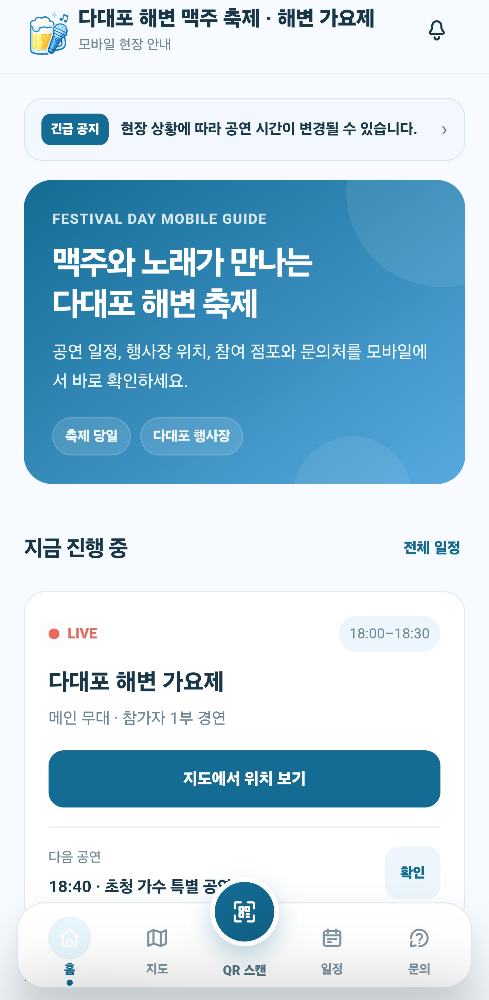
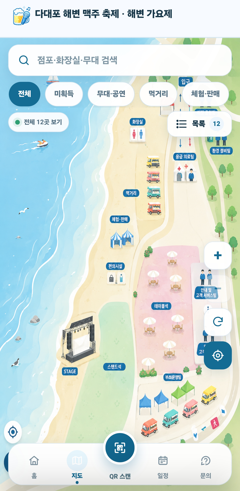
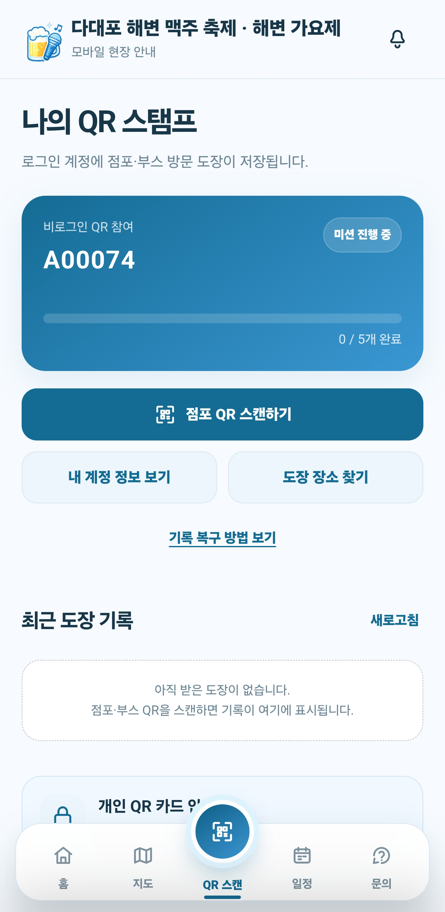
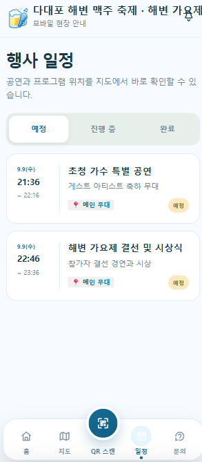
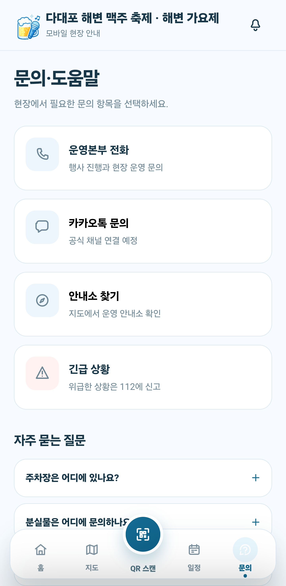

# 다대포 해변 맥주 축제 · 해변 가요제 모바일 안내

**로그인 없이 시작하는 QR 스탬프 투어 참가자 앱**

다대포 해변 맥주 축제 현장에서 참가자가 회원가입, 전화번호 인증, 개인정보 입력 없이 QR 코드 하나로 바로 참여할 수 있도록 만든 모바일 웹앱입니다. 축제 지도, 공연 일정, 참여 점포 QR 스탬프 투어, 실시간 공지를 하나의 화면에서 확인할 수 있습니다.

## 핵심 기능

**1. 비로그인 참가**
- 익명 참가권 생성: Firebase 익명 인증으로 즉시 시작하고, 브라우저에 저장된 참가권으로 재방문 시 자동 로그인됩니다
- 다중 참여 방식 통합: QR URL 자동 로그인, 개인 QR 카드, 아이디/구글 로그인 등 서로 다른 유입 경로를 하나의 참가자 식별 체계로 관리합니다

**2. QR 스탬프 투어**
- 카메라 실시간 스캔으로 참여 점포 QR을 인식해 도장을 적립합니다
- 카메라 사용이 어려운 상황을 대비해 이미지 업로드 인식과 수동 코드 입력을 함께 제공합니다
- Cloud Functions 호출을 통해 서버에서 스탬프 중복·위조 여부를 검증합니다

**3. 축제 지도**
- 두 손가락 확대/축소와 드래그 이동을 직접 구현한 커스텀 핀치줌·팬 제스처를 지원합니다
- 카테고리별 필터와 실시간 검색으로 부스·시설을 빠르게 찾을 수 있습니다

**4. 실시간 운영 연동**
- Firestore 구독을 통해 운영자 모니터 앱에서 갱신한 공지·일정·부스 정보가 참가자 화면에 즉시 반영됩니다
- 공연 일정은 현재 시각을 기준으로 진행 중/예정/완료 상태가 자동으로 전환됩니다

## 구현 기술

Vanilla JavaScript(ES6+) · 빌드 도구 없이 `<script>` 태그 기반으로 기능별 모듈을 분리한 구조 · Firebase(Anonymous/Email/Google Auth, Firestore, Cloud Functions) · CSS

## 실행 화면

| 홈 | 지도 | QR 스탬프 |
| --- | --- | --- |
|  |  |  |

| 일정 (예시 데이터) | 문의 |
| --- | --- |
|  |  |
